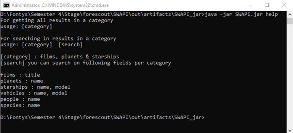
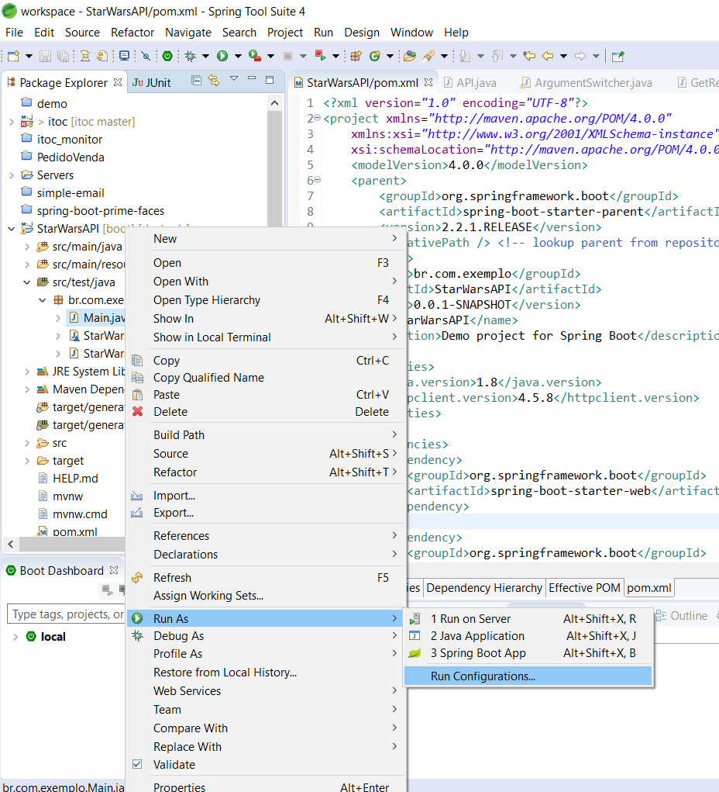
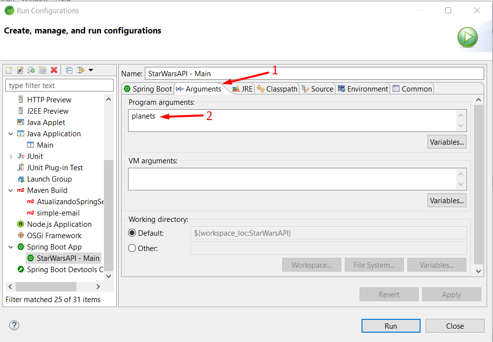

# StarWarsAPI
Implementação Java do SWAPI

Check https://swapi.co/ for the API documentation

Bibliotecas usadas:
  GSON (Google's JSON lib)
  Appache httpclient and httpcore (making API requests)
  Junit (unit testing)

Sintaxe console

Eclipse - Adicionando argumentos

Eclipse - Executando o projeto

